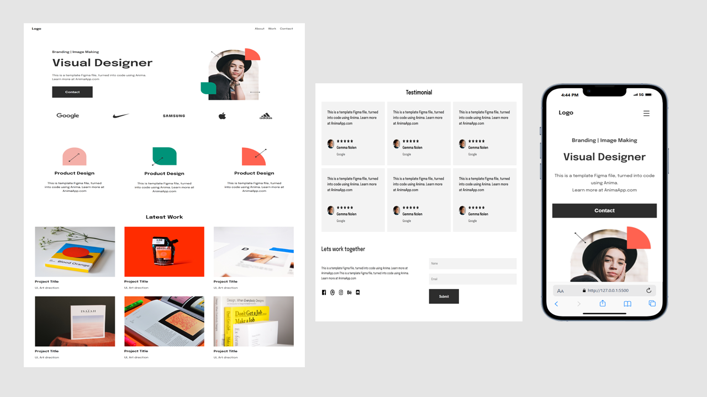

## Table of contents

- [Overview](#overview)
  - [Screenshot](#screenshot)
  - [Links](#links)
- [My process](#my-process)
  - [Built with](#built-with)
  - [What I learned](#what-i-learned)

## Overview
This is a Visual Designer Portfolio Website built using HTML and CSS, converted from a Figma template using Anima. The site showcases a designer’s branding and UI work with clean layout sections such as:

🧠 Hero Section with intro and contact CTA

🛠 Skills section with images and descriptions

🎨 Portfolio showcasing latest work/projects

⭐ Client Testimonials in a grid layout

📞 Contact section with social icons and contact form

📱 Responsive navigation with hamburger toggle

The design and code are simple, responsive, and visually driven — perfect for designers showcasing their branding/UI projects.

### Screenshot

### Links

- Solution URL: [View Code](https://github.com/Ramelzkie96/QR-Code-Component.git)
- Live Site URL: [Live Site](https://qr-components-code.netlify.app/)

## My process

### Built with

- HTML5 – For structuring the content and layout
- CSS3 – For styling, layout, and responsive design
- Vanilla JavaScript – Used minimally to handle the hamburger menu toggle on smaller screens

This project is purely front-end, without any frameworks or libraries — focused on clean, semantic markup and custom styling.

### What I learned

Throughout the development of this portfolio project, I gained valuable hands-on experience in several key areas:

1. Responsive Web Design: Learned how to structure and style layouts that adapt across various screen sizes using CSS Grid, Flexbox, and media queries.
2. CSS Variables: Utilized :root custom properties to maintain a consistent color scheme and font weights, improving maintainability and scalability.
3. Typography and Fonts: Integrated Google Fonts (Epilogue and Jost) and practiced applying appropriate font weights and spacing for better readability and aesthetics.
4. Component-Based Layouts: Broke down sections (Hero, Skills, Work, Testimonials, Contact) into clear, reusable patterns, improving design clarity and development speed.
5. Clean Code Practices: Focused on organizing styles logically, reducing redundancy, and following modern best practices for naming and structure.
6. Mobile-First Thinking: Designed with responsiveness in mind from the start, ensuring the site looks great on both desktop and mobile devices.
7. User Interface (UI) Design: Improved my understanding of spacing, visual hierarchy, and layout alignment to create a visually pleasing and accessible experience.